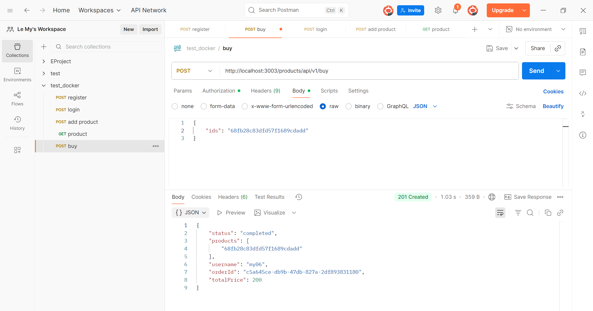

# File Tree: EProject-Phase-1

Root path: `d:\HK1_nam4\LTHDV_ThayNam\EProject\EProject-Phase-1`

```
├── api-gateway/

│   ├── node_modules/ (auto-hidden)

│   ├── Dockerfile

│   ├── index.js

│   ├── package-lock.json  (auto-hidden)

│   └── package.json

├── auth/

│   ├── node_modules/ (auto-hidden)

│   ├── src/

│   │   ├── config/

│   │   │   └── index.js

│   │   ├── controllers/

│   │   │   └── authController.js

│   │   ├── middlewares/

│   │   │   └── authMiddleware.js

│   │   ├── models/

│   │   │   └── user.js

│   │   ├── repositories/

│   │   │   └── userRepository.js

│   │   ├── services/

│   │   │   └── authService.js

│   │   ├── test/

│   │   │   └── authController.test.js

│   │   └── app.js

│   ├── .env (auto-hidden)

│   ├── Dockerfile

│   ├── index.js

│   ├── package-lock.json (auto-hidden)

│   └── package.json

├── order/

│   ├── node_modules/ (auto-hidden)

│   ├── src/

│   │   ├── models/

│   │   │   └── order.js

│   │   ├── utils/

│   │   │   ├── isAuthenticated.js

│   │   │   └── messageBroker.js

│   │   ├── app.js

│   │   └── config.js

│   ├── .env (auto-hidden)

│   ├── Dockerfile

│   ├── index.js

│   ├── package-lock.json (auto-hidden)

│   └── package.json

├── product/

│   ├── node_modules/  (auto-hidden)

│   ├── src/

│   │   ├── controllers/

│   │   │   └── productController.js

│   │   ├── models/

│   │   │   └── product.js

│   │   ├── repositories/

│   │   │   └── productsRepository.js

│   │   ├── routes/

│   │   │   └── productRoutes.js

│   │   ├── services/

│   │   │   └── productsService.js

│   │   ├── test/

│   │   │   └── product.test.js

│   │   ├── utils/

│   │   │   ├── isAuthenticated.js

│   │   │   └── messageBroker.js

│   │   ├── .DS_Store  (auto-hidden)

│   │   ├── app.js

│   │   └── config.js

│   ├── .env (auto-hidden)

│   ├── Dockerfile

│   ├── index.js

│   ├── package-lock.json  (auto-hidden)

│   └── package.json

├── rabbitmq/

│   └── Dockerfile

├── utils/

│   └── isAuthenticated.js

├── .gitignore

├── DEPLOYMENT.md

├── docker-compose.yml

├── package-lock.json  (auto-hidden)

└── package.json

```
--- 

## Prerequisites

Trước khi triển khai, cần có:

Docker Desktop (>= 24.x)

Node.js (>= 18.x) – chỉ nếu chạy thủ công ngoài Docker

MongoDB (qua Docker hoặc cài local)

RabbitMQ (rabbitmq:4-management)

Postman để kiểm thử API

## Local Development (Docker Compose)

Bắt đầu tất cả services

```bash
docker-compose up -d
```

Kiểm tra trạng thái

```bash
docker-compose ps
```

Xem log

```bash
docker-compose logs -f product
```

Dừng tất cả

```bash
docker-compose down
```

## Chạy từng service thủ công

Vào từng thư mục auth, product, order, api-gateway:

Cài dependencies RabbitMQ & MongoDB

RabbitMQ UI: 

http://localhost:15672

```bash

Username: guest
Password: guest
```

MongoDB URI:

mongodb://localhost:27017

1. Vào thư mục và cài dependency

Chạy Auth Service (cổng 3000)

```bash
cd EProject-Phase-1\auth
npm install
```

Chạy Product Service (cổng 3001)

```bash
cd EProject-Phase-1\product
npm install
```

Chạy Order Service (cổng 3002)

```bash
cd EProject-Phase-1\order
npm install
``` 

Chạy API Gateway (cổng 3003)

```bash
cd EProject-Phase-1\api-gateway
npm install
```

2. Chạy server 

```bash
npm run dev
```

## API Testing Flow (Postman)

1. Đăng ký người dùng: POST http://localhost:3003/auth/api/v1/register


2. Đăng nhập: POST http://localhost:3003/auth/api/v1/login


3. Tạo sản phẩm: POST http://localhost:3001/products/api/v1/add


4. Xem sản phẩm: GET http://localhost:3001/products/api/v1


5. Mua sản phẩm: POST http://localhost:3001/products/api/v1/buy



## Mongodb


